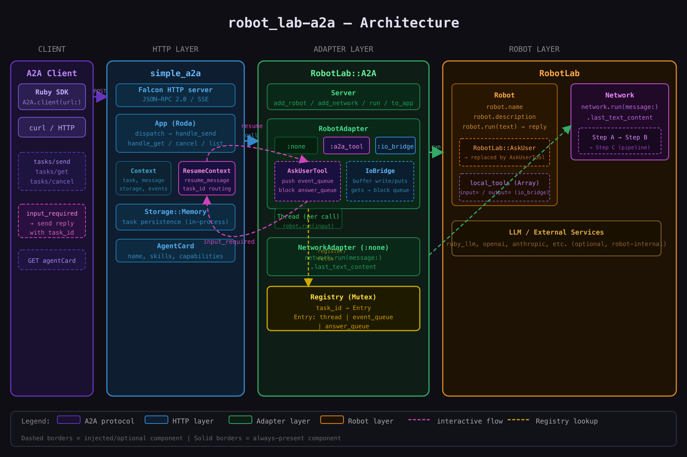

# robot_lab-a2a

`robot_lab-a2a` is an Agent2Agent (A2A) protocol adapter for RobotLab. It wraps RobotLab robots and networks in an HTTP+SSE server so any A2A-compliant client can invoke them, receive streaming events, and participate in multi-turn conversations — all without a terminal.

## How it fits together

## Key concepts

- **Server** (`RobotLab::A2A::Server`) — fluent builder that registers robots and networks as A2A agents, then starts an HTTP+SSE server via `simple_a2a`.
- **RobotAdapter** — wraps any `RobotLab::Robot`. Supports three modes: `:none` (synchronous), `:a2a_tool` (injects `AskUserTool` for multi-turn via Thread+Queue), and `:io_bridge` (replaces robot I/O streams for robots that use `gets`/`puts` directly).
- **NetworkAdapter** — wraps a `RobotLab::Network`. Runs the full pipeline in `:none` mode and returns the last text content.
- **AskUserTool** — drop-in replacement for `RobotLab::AskUser`. Converts a blocking terminal prompt into an A2A `input_required` event and waits for a client resume.
- **IoBridge** — IO-compatible object that buffers robot output and converts `gets` calls into `input_required` events, enabling interactive mode for robots that talk to raw streams.
- **Registry** — thread-safe singleton (Mutex-protected) keyed by A2A task ID. Holds `Entry(thread, event_queue, answer_queue)` so HTTP resume requests can find and unblock the correct robot thread.

## Documentation pages

- [Getting Started](getting-started.md) — installation, first server, client usage
- [Interactive Modes](interactive-modes.md) — `:none`, `:a2a_tool`, `:io_bridge` in depth
- [Server API](server-api.md) — full constructor and method reference
- [Examples](examples.md) — walkthrough of the bundled example scripts
